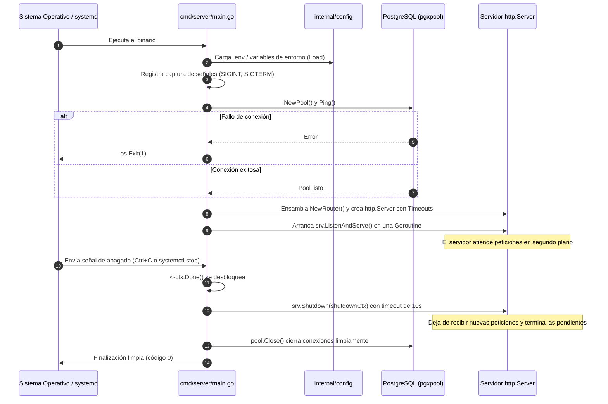

# Anatomía y Guía Técnica de la API Restaurant en Go

Este documento explica de forma exhaustiva la arquitectura, el código fuente, la lógica interna y el ciclo de vida completo de la API REST ubicada en `API_Restaurant/`, diseñada como el motor central local del restaurante "El Buen Sabor" / "Sabor Urbano".

---

## 1. Contexto, Filosofía y Selección Tecnológica

### 1.1 El Reto Operativo
Según los requerimientos del restaurante, el sistema debe operar en una red de área local (LAN) sin depender de una conexión activa a Internet. Durante horas pico, una caída de Internet no debe detener la recepción de comandas en cocina, la toma de pedidos vía códigos QR o el cobro de cuentas.

### 1.2 ¿Por qué Go (Golang)?
1. **Binario Único y Estático (`CGO_ENABLED=0`)**: No requiere instalar runtimes externos (como Node.js, Python o JVM) en el servidor de destino. Todo el código compilado se empaqueta en un ejecutable autocontenido.
2. **Eficiencia en Recursos y Baja Latencia**: Un servidor en Go consume apenas entre 15 MB y 35 MB de memoria RAM en reposo, lo que lo hace perfecto para mini PCs económicas o hardware reutilizado.
3. **Concurrencia Nativa (Goroutines y Canales)**: Permite atender cientos de peticiones simultáneas de comensales escaneando el menú y actualizando órdenes en cocina con un costo mínimo de CPU.
4. **Tipado Estático y Seguridad en Tiempo de Compilación**: Evita errores comunes de tipado en tiempo de ejecución (`null pointers`, campos inexistentes en JSON).
5. **Estabilidad a Largo Plazo**: La biblioteca estándar de Go garantiza compatibilidad hacia atrás estricta.

---

## 2. Mapa Estructural del Proyecto

La estructura sigue el estándar canónico de proyectos en Go:

```
API_Restaurant/
├── cmd/
│   └── server/
│       └── main.go                 # Punto de entrada de la aplicación
├── internal/
│   ├── config/
│   │   └── config.go              # Carga y validación de variables de entorno
│   ├── httpserver/
│   │   ├── response.go            # Estandarización de respuestas JSON (Envelope)
│   │   └── router.go              # Enrutador HTTP y middlewares globales
│   └── platform/
│       └── db/
│           └── db.go              # Pool de conexiones a PostgreSQL (pgxpool)
├── .env.example                   # Plantilla de variables de entorno
├── .gitignore                     # Exclusiones para control de versiones
├── Makefile                       # Automatización de tareas de desarrollo
├── README.md                      # Documentación básica de ejecución
├── go.mod                         # Definición del módulo y versiones de dependencias
└── go.sum                         # Checksums criptográficos de dependencias
```

### ¿Por qué `cmd/` vs `internal/`?
- **`cmd/server/main.go`**: Solo contiene el pegamento ("wiring") para iniciar y apagar la aplicación. No implementa lógica de negocio ni manipulación de base de datos.
- **`internal/`**: Go aplica una regla estricta en tiempo de compilación: ningún paquete fuera del módulo raíz puede importar código dentro de `internal/`. Esto protege las capas internas de la API frente a acoplamientos no deseados y preserva la encapsulación.

---

## 3. Desglose Línea por Línea del Código Fuente

A continuación se analiza el propósito técnico y funcional de cada componente implementado.

---

### 3.1 Gestión de Dependencias: `go.mod` y `go.sum`

#### Contenido de `go.mod`
```go
module github.com/saborurbano/api_restaurant

go 1.25.0

require (
	github.com/jackc/pgx/v5 v5.11.0
	github.com/joho/godotenv v1.5.1
)
```

#### ¿Por qué estas dependencias?
1. **`github.com/jackc/pgx/v5`**:
   - Es el driver nativo de PostgreSQL más rápido y maduro para Go.
   - Supera ampliamente al paquete estándar `database/sql` genérico en rendimiento y soporte de tipos específicos de PostgreSQL (como arrays, tipos compuestos, JSONB y tipos ENUM usados en `elbuensabor_schema.sql`).
   - El submódulo `pgxpool` implementa un pool de conexiones optimizado para concurrencia.
2. **`github.com/joho/godotenv`**:
   - Permite leer archivos `.env` durante el desarrollo local en la máquina del programador.
   - En producción, la aplicación ignora el archivo si no existe y toma los valores del servicio `systemd` (`EnvironmentFile=/etc/api_restaurant.env`).

---

### 3.2 Configuración Centralizada: `internal/config/config.go`

Este archivo centraliza todos los parámetros configurables de la aplicación.

#### Struct de Dominio
```go
type Config struct {
	AppEnv   string
	LogLevel string

	DBHost     string
	DBPort     string
	DBName     string
	DBUser     string
	DBPassword string
	DBPoolMax  int32
	DBPoolMin  int32

	ServerHost         string
	ServerPort         string
	ServerReadTimeout  time.Duration
	ServerWriteTimeout time.Duration
	ServerIdleTimeout  time.Duration

	JWTSecret    string
	JWTExpiry    time.Duration
	JWTPinExpiry time.Duration
}
```

#### ¿Por qué un struct en lugar de leer `os.Getenv` en cada función?
- **Inmutabilidad y Visibilidad**: Los valores se leen una sola vez al arrancar el programa. Si falta una variable crítica o tiene un formato inválido, el sistema falla de inmediato ("fail-fast") antes de aceptar tráfico.
- **Tipado Seguro**: Convierte cadenas de texto crudas en tipos nativos seguros de Go: `int32` para el tamaño del pool de base de datos y `time.Duration` para los timeouts de red y expiración de tokens JWT.

#### Funciones Auxiliares con Valores por Defecto
```go
func Load() Config { ... }
func getEnv(key, fallback string) string { ... }
func getEnvInt32(key string, fallback int32) int32 { ... }
func getEnvDuration(key string, fallback time.Duration) time.Duration { ... }
```
- **`getEnv`**: Si la variable de entorno no está definida en el sistema, aplica un valor predeterminado seguro para desarrollo (`development`, `localhost`, `8080`).
- **`getEnvInt32`**: Utiliza `strconv.ParseInt(v, 10, 32)` para convertir cadenas a enteros de 32 bits, evitando desbordamientos de memoria.
- **`getEnvDuration`**: Utiliza `time.ParseDuration` para interpretar formatos legibles por humanos como `"15s"`, `"1m"` u `"8h"`.

---

### 3.3 Conectividad y Resiliencia con la Base de Datos: `internal/platform/db/db.go`

Este archivo gestiona el ciclo de vida de la conexión física hacia PostgreSQL.

```go
package db

import (
	"context"
	"fmt"

	"github.com/jackc/pgx/v5/pgxpool"
	"github.com/saborurbano/api_restaurant/internal/config"
)

func NewPool(ctx context.Context, cfg config.Config) (*pgxpool.Pool, error) {
	dsn := fmt.Sprintf(
		"postgres://%s:%s@%s:%s/%s?sslmode=disable&pool_max_conns=%d&pool_min_conns=%d",
		cfg.DBUser, cfg.DBPassword, cfg.DBHost, cfg.DBPort, cfg.DBName,
		cfg.DBPoolMax, cfg.DBPoolMin,
	)

	pool, err := pgxpool.New(ctx, dsn)
	if err != nil {
		return nil, fmt.Errorf("creando pool de conexiones: %w", err)
	}

	if err := pool.Ping(ctx); err != nil {
		pool.Close()
		return nil, fmt.Errorf("verificando conexion a la base de datos: %w", err)
	}

	return pool, nil
}
```

#### Análisis Técnico:
1. **Construcción del DSN (Data Source Name)**:
   - `sslmode=disable`: Al operar dentro de la red privada local física del restaurante, se deshabilita la sobrecarga de cifrado TLS entre la API y PostgreSQL alojados en la misma máquina o switch local.
   - `pool_max_conns` y `pool_min_conns`: Mantienen un número controlado de conexiones abiertas listas para usar. Esto elimina la latencia de negociar el handshake TCP con la base de datos en cada petición HTTP entrante.
2. **`pool.Ping(ctx)` Obligatorio**:
   - `pgxpool.New` únicamente valida la sintaxis de la cadena de conexión; no garantiza que la base de datos esté viva o acepte contraseñas.
   - Llamar a `Ping` en el arranque asegura que si PostgreSQL está apagado o las credenciales son erróneas, el servidor se detenga con un mensaje de error claro en lugar de aceptar clientes y fallar en cada endpoint.
3. **`%w` en `fmt.Errorf`**:
   - Envuelve el error original preservando el árbol de traza para auditoría y diagnóstico de fallos.

---

### 3.4 Estandarización de Respuestas HTTP: `internal/httpserver/response.go`

Para cumplir con el diseño especificado en `docs/api_manual.md`, todas las respuestas de la API deben seguir un formato uniforme ("envelope pattern").

```go
type envelope struct {
	Success bool        `json:"success"`
	Data    interface{} `json:"data,omitempty"`
	Meta    interface{} `json:"meta,omitempty"`
	Error   *apiError   `json:"error,omitempty"`
}

type apiError struct {
	Code    string `json:"code"`
	Message string `json:"message"`
}
```

#### ¿Por qué usar este patrón?
- **Consistencia en el Frontend**: Las aplicaciones clientes (PWA del cliente, tablet del mesero, KDS de cocina) siempre reciben la misma estructura JSON:
  - Si `success: true`, los datos residen en `data`. Si el endpoint tiene paginación, los contadores vienen en `meta`.
  - Si `success: false`, la propiedad `error` contiene un código legible por máquina (`code`) y un mensaje para el usuario (`message`).
- **Uso de `omitempty`**: Si no hay error, el campo `"error"` no se envía en el JSON final, reduciendo el peso de la carga en redes inalámbricas.

#### Funciones de Salida
- `WriteSuccess(w, status, data)`: Genera respuestas exitosas (`200 OK`, `201 Created`).
- `WritePaginated(w, status, data, meta)`: Para listados de productos, órdenes o auditoría de inventario.
- `WriteError(w, status, code, message)`: Respuestas de error estandarizadas (`400 BAD_REQUEST`, `401 UNAUTHORIZED`, `404 NOT_FOUND`).

---

### 3.5 Enrutamiento y Middleware: `internal/httpserver/router.go`

Este archivo expone el constructor del enrutador HTTP de la aplicación.

```go
func NewRouter(healthCheck func() error) http.Handler {
	mux := http.NewServeMux()

	mux.HandleFunc("GET /health", func(w http.ResponseWriter, r *http.Request) {
		if err := healthCheck(); err != nil {
			WriteError(w, http.StatusServiceUnavailable, "DB_UNAVAILABLE", err.Error())
			return
		}
		WriteSuccess(w, http.StatusOK, map[string]string{"status": "ok"})
	})

	mux.HandleFunc("GET /api/v1/version", func(w http.ResponseWriter, r *http.Request) {
		WriteSuccess(w, http.StatusOK, map[string]string{"version": "0.1.0"})
	})

	return withLogging(mux)
}
```

#### Decisiones de Diseño Clave:
1. **Enrutamiento Nativo de Go (Go 1.22+)**:
   - `http.NewServeMux()` en versiones modernas de Go permite definir métodos HTTP y parámetros dinámicos directamente en el patrón (ejemplo: `"GET /health"`, `"POST /api/v1/auth/login"`, `"GET /api/v1/menu/productos/{id}"`).
   - Elimina la necesidad de frameworks externos pesados como Gin, Fiber o Gorilla Mux, manteniendo cero dependencias de routing.
2. **Inyección de Dependencia (`healthCheck func() error`)**:
   - El enrutador no necesita conocer el pool de base de datos directamente; recibe una función anónima que devuelve un error si la base de datos se desconecta. Esto desacopla el transporte HTTP de la infraestructura de almacenamiento y simplifica las pruebas unitarias con mocks.
3. **Middleware de Logging Estructurado (`withLogging`)**:
   - Envuelve el `http.Handler` para interceptar cada petición.
   - Utiliza `log/slog` (introducido en Go 1.21) para emitir trazas en formato estructurado:
     - Método HTTP (`r.Method`).
     - Ruta solicitada (`r.URL.Path`).
     - Duración exacta de procesamiento en milisegundos (`time.Since(start).Milliseconds()`).

---

### 3.6 Entrada Principal y Apagado Ordenado: `cmd/server/main.go`

El archivo `main.go` orquesta todo el sistema desde su arranque hasta su apagado ordenado ("Graceful Shutdown").

#### Paso a Paso del Flujo de Ejecución:



#### Código Crítico Explicado:

1. **Configuración de Timeouts en `http.Server`**:
   ```go
   srv := &http.Server{
       Addr:         cfg.ServerHost + ":" + cfg.ServerPort,
       Handler:      router,
       ReadTimeout:  cfg.ServerReadTimeout,
       WriteTimeout: cfg.ServerWriteTimeout,
       IdleTimeout:  cfg.ServerIdleTimeout,
   }
   ```
   *Riesgo evitado*: Si un comensal con mala señal WiFi deja una conexión a medias, un servidor sin timeouts retendría sockets abiertos indefinidamente, saturando el sistema (ataque tipo *Slowloris* involuntario). Estos parámetros fuerzan el cierre de sockets colgados.

2. **Ejecución en Goroutine Concurrente**:
   ```go
   go func() {
       if err := srv.ListenAndServe(); err != nil && !errors.Is(err, http.ErrServerClosed) {
           slog.Error("error del servidor HTTP", "error", err)
           os.Exit(1)
       }
   }()
   ```
   *Razón*: `ListenAndServe()` es una llamada bloqueante. Al ejecutarla dentro de una goroutine con la palabra clave `go`, el hilo principal queda libre para escuchar señales del sistema operativo.

3. **Captura de Señales y Apagado Ordenado ("Graceful Shutdown")**:
   ```go
   ctx, stop := signal.NotifyContext(context.Background(), os.Interrupt, syscall.SIGTERM)
   defer stop()
   
   <-ctx.Done() // Espera pasivamente la señal SIGINT o SIGTERM
   slog.Info("apagando servidor...")

   shutdownCtx, cancel := context.WithTimeout(context.Background(), 10*time.Second)
   defer cancel()

   if err := srv.Shutdown(shutdownCtx); err != nil {
       slog.Error("error durante el apagado", "error", err)
   }
   ```
   *Razón*: Cuando `systemd` o el usuario detienen el proceso (`systemctl stop api_restaurant` o `Ctrl+C`), el servidor:
   - Deja de aceptar nuevas peticiones en el puerto 8080.
   - Da hasta 10 segundos de gracia para que las peticiones en curso (por ejemplo, una orden guardándose o un pago registrándose) concluyan de forma consistente sin corromper datos.
   - Cierra ordenadamente el pool de conexiones a la base de datos (`defer pool.Close()`).

---

## 4. Ciclo de Vida de una Petición (Request Lifecycle)

Cuando un dispositivo cliente hace una solicitud HTTP, el flujo a través del código es el siguiente:

1. **Capa de Red**: La petición entra por la interfaz de red del servidor al puerto `8080`.
2. **Capa HTTP Server**: La goroutine de `net/http` acepta la conexión TCP y aplica `ReadTimeout`.
3. **Middleware `withLogging`**: Registra la hora de entrada (`time.Now()`) y pasa el control al enrutador.
4. **Router `http.ServeMux`**: Evalúa el método y ruta (`GET /health`, `GET /api/v1/...`).
5. **Función Controladora (Handler)**:
   - Valida la lógica requerida. En `/health`, ejecuta la función de verificación inyectada (`pool.Ping`).
6. **Capa de Persistencia**: El driver `pgxpool` toma una conexión inactiva del pool, envía el paquete SQL `PING` a PostgreSQL y devuelve el resultado.
7. **Formateo de Respuesta**: Se invoca `WriteSuccess` o `WriteError`, serializando la estructura `envelope` a JSON con cabecera `Content-Type: application/json`.
8. **Retorno de Traza**: El middleware calcula `time.Since(start)` y escribe la línea de log estructurado en stdout/journald.

---

## 5. Instrucciones Paso a Paso: De la Programación a la Ejecución

### 5.1 Entorno de Desarrollo Local

Para programar y probar en la máquina de trabajo:

#### Paso 1: Configurar credenciales locales
Copiar la plantilla de configuración y ajustar los parámetros de PostgreSQL:
```bash
cd /home/evazquez/Desarrollo/elbuensabor/API_Restaurant
cp .env.example .env
```
Editar `.env` verificando que coincida con el usuario y contraseña de la base de datos local:
```env
DB_HOST=localhost
DB_PORT=5432
DB_NAME=elbuensabor
DB_USER=api_user
DB_PASSWORD=TuPasswordReal
```

#### Paso 2: Verificar e instalar dependencias
```bash
go mod tidy
```
Esto descarga las versiones exactas registradas en `go.mod` y valida las sumas de comprobación en `go.sum`.

#### Paso 3: Ejecución en caliente
```bash
make run
# o directamente:
go run ./cmd/server
```
La salida esperada en consola confirmará el inicio:
```text
2026/09/25 10:00:00 INFO iniciando servidor HTTP addr=0.0.0.0:8080 env=development
```

#### Paso 4: Comprobación funcional inmediata
En otra terminal:
```bash
curl -i http://localhost:8080/health
```
Respuesta exitosa:
```http
HTTP/1.1 200 OK
Content-Type: application/json
Date: Fri, 25 Sep 2026 10:00:05 GMT

{"success":true,"data":{"status":"ok"}}
```

---

### 5.2 Compilación para Producción

En producción no se utiliza `go run` (que compila en memoria temporal cada vez). Se genera un binario optimizado sin dependencias externas:

```bash
cd /home/evazquez/Desarrollo/elbuensabor/API_Restaurant

# Compilación estática optimizada
CGO_ENABLED=0 GOOS=linux GOARCH=amd64 go build -ldflags="-s -w" -o bin/api_restaurant ./cmd/server
```

#### Explicación de las banderas del compilador:
- `CGO_ENABLED=0`: Deshabilita el enlace dinámico a la biblioteca estándar de C (`glibc`). El binario resultante corre en cualquier distribución Linux (Fedora, Debian, Ubuntu, Alpine) sin importar versiones de librerías del sistema operativo.
- `GOOS=linux`: Fuerza el sistema operativo de destino a Linux.
- `GOARCH=amd64`: Arquitectura de procesadores Intel/AMD de 64 bits (usar `GOARCH=arm64` para Raspberry Pi o mini PCs ARM).
- `-ldflags="-s -w"`: Elimina la tabla de símbolos de depuración (`-s`) y la información DWARF (`-w`), reduciendo el tamaño del binario final hasta en un 30% a 40%.

---

### 5.3 Despliegue en el Servidor como Servicio Permanente (`systemd`)

Siguiendo las especificaciones de `docs/instalacion_servidor.md`, la API se gestiona mediante el administrador de servicios del sistema operativo Linux.

#### Paso 1: Instalar el binario en la ruta del sistema
```bash
sudo mkdir -p /opt/api_restaurant/bin
sudo mkdir -p /opt/api_restaurant/logs
sudo cp /home/evazquez/Desarrollo/elbuensabor/API_Restaurant/bin/api_restaurant /opt/api_restaurant/bin/
sudo chown -R api_restaurant:api_restaurant /opt/api_restaurant
sudo chmod 750 /opt/api_restaurant/bin/api_restaurant
```

#### Paso 2: Crear el archivo de configuración seguro en `/etc`
```bash
sudo cp /home/evazquez/Desarrollo/elbuensabor/API_Restaurant/.env.example /etc/api_restaurant.env
sudo chmod 600 /etc/api_restaurant.env
sudo chown root:root /etc/api_restaurant.env
```
*(Editar `/etc/api_restaurant.env` con la contraseña de producción de PostgreSQL y el `JWT_SECRET` generado con `openssl rand -base64 64`)*.

#### Paso 3: Registrar la unidad de servicio `systemd`
El archivo `/etc/systemd/system/api_restaurant.service` contiene las directivas para mantener la API en ejecución permanente:
```ini
[Unit]
Description=El Buen Sabor - API REST Go
After=network.target postgresql.service
Requires=postgresql.service

[Service]
Type=simple
User=api_restaurant
Group=api_restaurant
WorkingDirectory=/opt/api_restaurant
EnvironmentFile=/etc/api_restaurant.env
ExecStart=/opt/api_restaurant/bin/api_restaurant
Restart=on-failure
RestartSec=5s

# Seguridad
NoNewPrivileges=yes
ProtectSystem=strict
ProtectHome=yes
ReadWritePaths=/opt/api_restaurant/logs
PrivateTmp=yes

# Salida a los logs del sistema
StandardOutput=journal
StandardError=journal
SyslogIdentifier=api_restaurant

[Install]
WantedBy=multi-user.target
```

#### Paso 4: Habilitar y arrancar el servicio
```bash
sudo systemctl daemon-reload
sudo systemctl enable --now api_restaurant
```

#### Paso 5: Verificación del estado y monitoreo de logs en vivo
```bash
# Comprobar que está en ejecución (active - running)
sudo systemctl status api_restaurant

# Inspeccionar logs en tiempo real
sudo journalctl -u api_restaurant -f
```

---

## 6. Integración Futura de Módulos (Fases 1 a 8)

El scaffold actual está diseñado para expandirse de forma limpia sin reescribir la base del servidor. Cuando se implementen los módulos del catálogo (`menu`), comandas (`operaciones`), personal (`personal`) y cobros (`pagos`), cada uno se estructurará siguiendo el patrón de 4 archivos:

```
internal/menu/
├── model.go       # Structs que mapean tablas: menu.productos, menu.categorias
├── repository.go  # Métodos que ejecutan sentencias SQL vía pgxpool
├── service.go     # Reglas de negocio (validar stock, verificar horarios)
└── handler.go     # Controladores HTTP que llaman a WriteSuccess/WriteError
```

Y en `internal/httpserver/router.go` se conectarán sus rutas mediante:
```go
menuRepo := menu.NewRepository(pool)
menuService := menu.NewService(menuRepo)
menu.RegisterRoutes(mux, menuService)
```

Esto garantiza un desarrollo modular, mantenible, desacoplado y de alto rendimiento.
